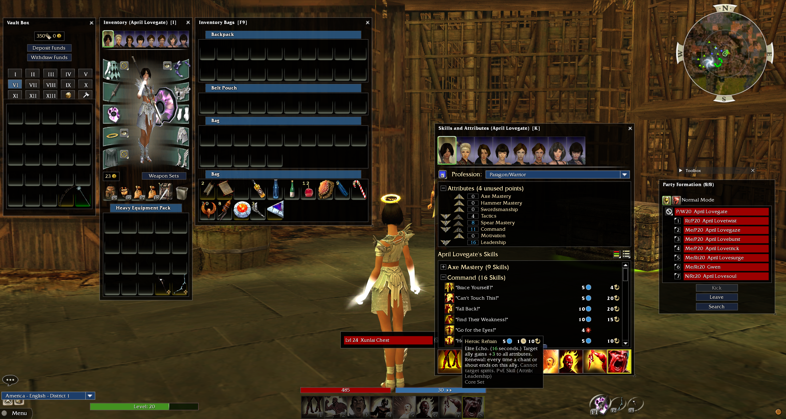

# MinUIDark

## About

Modified version of [Minimulus UI by Jujin](https://wiki.guildwars.com/wiki/User:Jujin/Minimalus_UI_Mod).

## Changes to the Original

- Increased opacity of most things to at least 80%
- No transparency on tooltips
- Increased readability of vault, merchant tabs
- Removed some assets like compass and some fonts and icons that I didn't like

## Notes
- Release zip is designed to work with gMod not uMod or Texmod
- The dds files are provided, so you could make your own TPF version if you really wanted

## Using with the Original

I use this on its own, but you can probably use this with the original and the other mod [Clarity by Kazerniel](https://wiki.guildwars.com/wiki/Player-made_Modifications/GUI_Index), but I have not tested it.

You would change gMod's modlist.txt to something like:
```
C:\games\gw\mods\minuidark.zip
C:\games\gw\mods\clarity.zip
C:\games\gw\mods\minimulus.zip
```
## Screenshot



